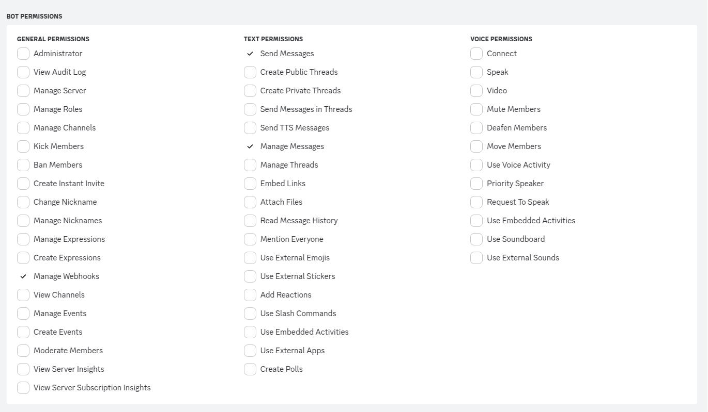

# berner


## About

http4sでdiscordのbotを書いてみるテスト

## GitHub Actionsの設定

以下を参照  
[sbt/sbt-ci-release: sbt plugin to automate Sonatype releases from GitHub Actions](https://github.com/sbt/sbt-ci-release#secrets)

## マイグレーションについて

### require

- [Command-line - Command-line tool - Flyway by Redgate • Database Migrations Made Easy.](https://flywaydb.org/documentation/usage/commandline/)

### 手順

```bash
$ flyway -configFiles="flyway.sample.conf" migrate

# WARNING: A Flyway License was not provided; fell back to Community Edition. Please contact sales at sales@flywaydb.org for license information.
# Flyway Community Edition 9.20.0 by Redgate
# See release notes here: https://rd.gt/416ObMi
# 
# Database: jdbc:mysql://127.0.0.1:13306/database_name (MariaDB 11.0)
# WARNING: Flyway upgrade recommended: MariaDB 11.0 is newer than this version of Flyway and support has not been tested. The latest supported version of MariaDB is 10.10.
# Schema history table `database_name`.`flyway_schema_history` does not exist yet
# Successfully validated 1 migration (execution time 00:00.013s)
# Creating Schema History table `database_name`.`flyway_schema_history` ...
# Current version of schema `database_name`: << Empty Schema >>
# Migrating schema `database_name` to version "1 - initial version"
# Successfully applied 1 migration to schema `database_name`, now at version v1 (execution time 00:00.039s)
```

## Discord関連のメモ

- `hub-times`には`times-`で始まるチャンネルのメッセージが転送される
  - 前提条件は以下
  - `hub-times`チャンネルの作成
  - `hub-times`チャンネルにwebhookを設定
  - アプリケーションにwebhookのidとtokenを設定

### Botの権限周りの設定




## Dockerイメージのビルド

```
sbt docker:publishLocal
```

Docker Plugin — sbt-native-packager 1.9.0 documentation : https://www.scala-sbt.org/sbt-native-packager/formats/docker.html

## Dockerイメージの実行例

```
docker run -it --rm --env-file ./.env berner:0.1.0-SNAPSHOT
```

必要に応じて`--add-host=host.docker.internal:host-gateway`

## 環境変数

| 変数名                                    | 説明                             | 補足                                                          |
|----------------------------------------|--------------------------------|-------------------------------------------------------------|
| BERNER_DISCORD_TOKEN                   | DiscordのBotのトークン               | Developer Portal から取得                                       |
| BERNER_DISCORD_TIMES_HUB_WEBHOOK_ID    | `hub-times`チャンネルのwebhookのid    | https://discord.com/api/webhooks/[WEBHOOK_ID]/WEBHOOK_TOKEN |
| BERNER_DISCORD_TIMES_HUB_WEBHOOK_TOKEN | `hub-times`チャンネルのwebhookのtoken | https://discord.com/api/webhooks/WEBHOOK_ID/[WEBHOOK_TOKEN] |
| BERNER_DATABASE_PRIMARY_HOST           | データベースのホスト                     |                                                             |
| BERNER_DATABASE_PRIMARY_PORT           | データベースのポート                     |                                                             |
| BERNER_DATABASE_PRIMARY_NAME           | データベースの名前                      |                                                             |
| BERNER_DATABASE_PRIMARY_USER           | データベースのユーザー名                   |                                                             |
| BERNER_DATABASE_PRIMARY_PASSWORD       | データベースのパスワード                   |                                                             |
